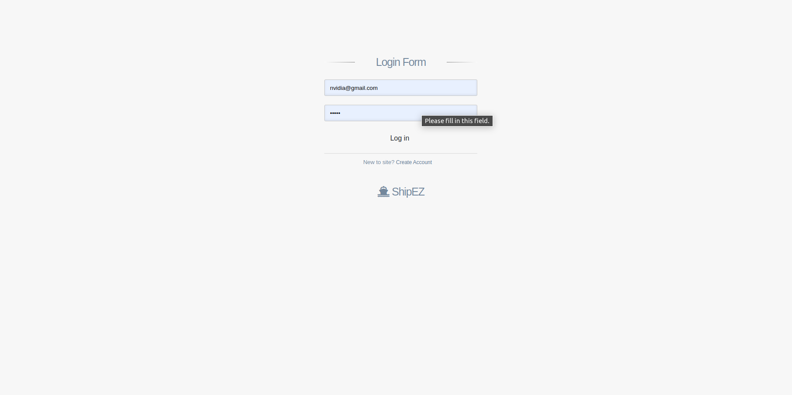
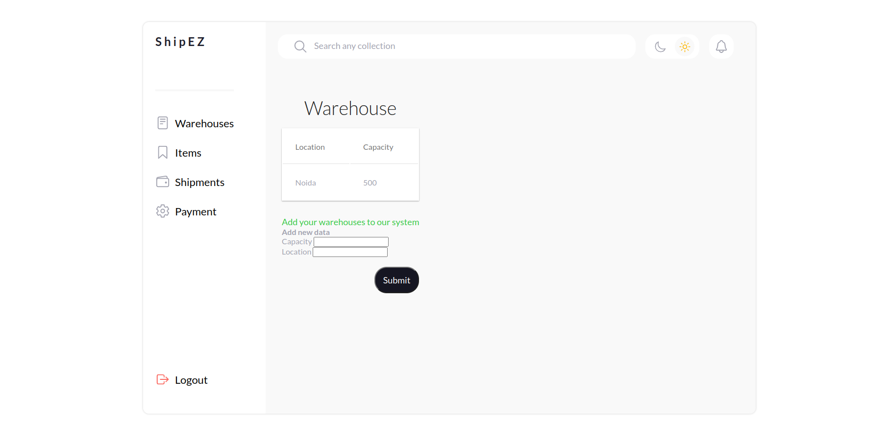

# ShipEZ

One stop solution for Managing Warehouses and Shipping products.

## Installation

Use the package manager to install ShipEZ.

```bash
npm install
```

## Run on local server
Add the MongoURL in .env file
```bash
copy .env.copy .env
```
To start the server
```bash
node index
```
Home Page


Login Page


Dashboard Page

